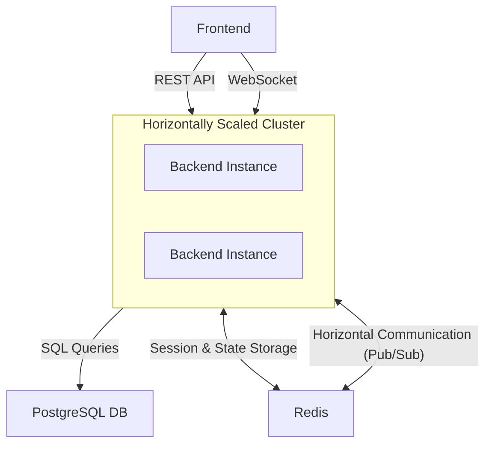

# LeetCode Duels


A browser extension that lets you challenge friends to real-time LeetCode duels.

## Getting Started

#### Clone the repository
```bash
git clone https://github.com/etbala/LeetCodeDuels.git
cd LeetCodeDuels
```

## Extension

### 1. Install Dependencies
Install Node.js (v22+) and Angular CLI
```bash
npm install -g @angular/cli
```

### 2. Build Extension
```bash
cd extension
npm install
ng build
```

Note: Build using `-c local` if you are trying to run the server locally:
```bash
ng build -c local
```

### 3. Load Extension in Browser
Load Unpacked Extension from Directory: `/extension/dist/browser`

> For Chrome, see https://support.google.com/chrome/a/answer/2714278

> For Firefox, see https://extensionworkshop.com/documentation/develop/temporary-installation-in-firefox/

## Server

### 1. Install Dependencies
Go (v1.24+)

### 2. Set up .env
Create a `.env` file in the `/server` directory by copying the template file: [`/server/.env.template`](./server/.env.template).
> Ensure final file is located at `LeetCodeDuels/server/.env`

### 3. Run Server
```bash
cd server
go run ./cmd/server
```

## Testing

### Server Tests
Install Docker.

```bash
cd server
go test ./... -v
```

### Server Stress Tests
Install Grafana k6

```bash
cd server/tests/k6
./stress-test.ps1
```

## High Level Architecture


### Architecture Breakdown

* **Frontend**: This is the client-side application that the user interacts with. It communicates with the backend using two methods:

    * *REST API*: Used for standard actions like user login, registration, fetching user profiles, etc. Generally, if a REST endpoint is used, it will query the Postgres DB.

    * *WebSockets*: Used for real-time, two-way communication required for gameplay, invitations, and live online status updates.

* **Backend Cluster**: The core application logic resides in a horizontally scalable cluster of backend instances. Designing the server to be stateless allows us to run multiple instances behind a load balancer so the backend can automatically scale to meet demand.

* **PostgreSQL DB**: Long-term storage. Handles account information, game history, and mirrors a simplified version of leetcode's problem database. Generally accessed via REST endpoints.

* **Redis**:

    * *Session & State Storage*: Stores ephemeral (temporary) data like active game sessions, pending user invites, and which users are currently online.

    * *Horizontal Communication (Pub/Sub)*: Redis acts as a message bus that allows the different backend instances to communicate with each other. For example, if a user connected to Instance A sends a game invite to a user connected to Instance B, the message is published to a Redis channel, which instantly delivers it to the correct instance.
